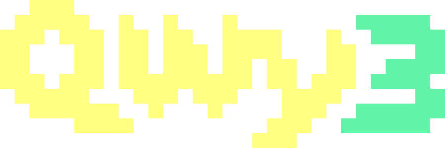
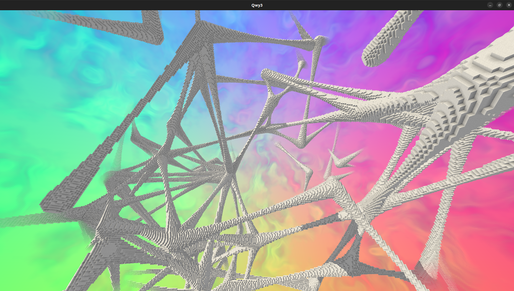
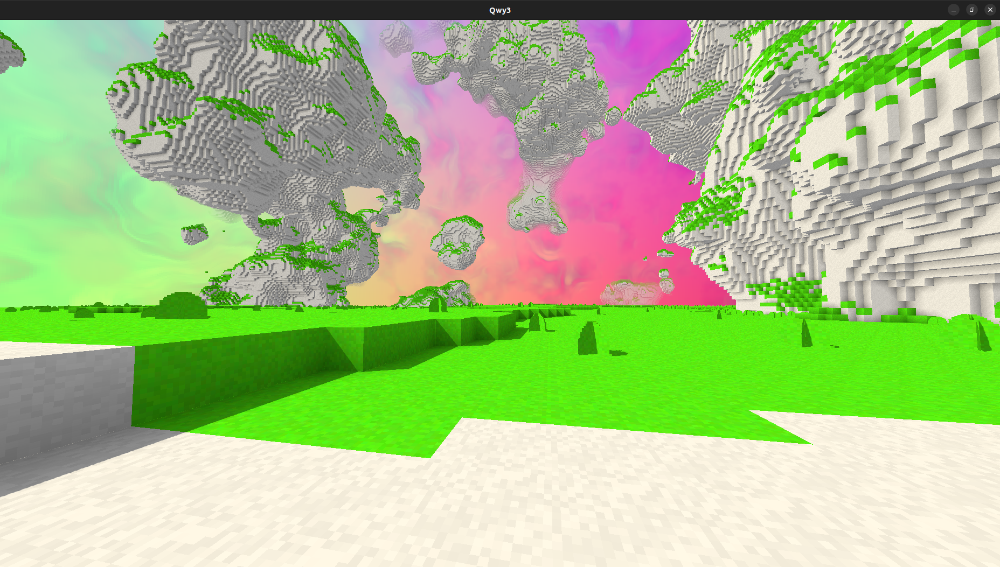
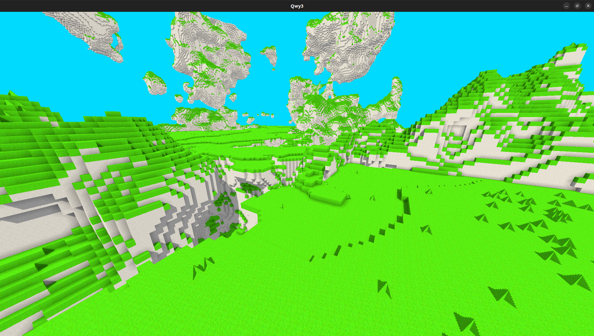

# Qwy3

</>

Wanna-be Minecraft-like in Rust using <a href="url">Wgpu</a>, very early stage.

</>

</>

</>

### Build

Install [Rust](https://www.rust-lang.org/tools/install) first (via `rustup`, Rust's official toolchain manager, which will also install tools such as `cargo` which manages Rust projects and dependencies). Then clone/download this repo and run one of the example `cargo` commands below (or just `cargo build --release` to build without running the project).

### Usage

Examples:
- `cargo run --release -- --threads 8 --gen-dist 210 --gen structures-links-smooth`
- `cargo run --release -- --threads 4 --gen-dist 300 --gen default --seed 3 --chunk-edge 50`
- `cargo run --release -- --threads 12 --gen structures-generated-blocks --save hello`

Note:
The `--save <SAVE_NAME>` or `-s <SAVE_NAME>` option creates or opens the save of the specified name and will save/load the game state (seed, player position, chunks, etc.) to/from the disk. Not specifying a save means that nothing will be saved and all that is unloaded is lost.

Advice:
- Up the number of `--threads` the game shall use to almost the number of virtual cores of the hardware.
- Experiment with the `--chunk-edge` parameter to see how it impacts the performance while allowing to load larger areas by upping `--gen-dist`.
- Try out the various world generators available (`--gen-names` to display the list).
- Be ready to press P (default key) to disable falling when using world generators that lack a ground, or be ready to fall for some time.
- Read `controls.qwy3_controls` to get a list of controls and see what can be done once the game run.
- Some useful default controls: WASD to move, P to toggle physics (fly) and mouse wheel to go up and down, U to toggle the interface, K to let the mouse escape, left/right click to remove/place blocks.

### Implemented features

- Blocks, chunks, meshes.
- Chunks, loading and unloading so that an area around the player is loaded.
- Infinite-ish world, in all directions including up and down.
- Removing and placing blocks.
- Saving/loading to/from disk, named saves.
- AABB vs voxels collision resolution.
- Multiple world generators, some use a cool and fast structure generation engine.
- Skybox.
- Fog effect (blocks in the distance fading in the skybox).
- Multithreading.
- Command bar (the command language has basically nothing in it yet but the command bar is there).
- Shadows via cascading shadow mapping.
- Configurable controls for most controls.

### Controls

Default controls make sense for QWERTY keyboards. Most controls are configurable by editing the  `controls.qwy3_controls` file (created by the game in the current directory when it doesn't exist yet).

The syntax is intuitive, key names are letters, numbers, or `up`, `down`, `left`, `right`, `space`, `left_shift`, `right_shift`, `tab`, `return`/`enter`; mouse button names are `left`, `right`, `middle`, or numbers.

### License

All the code and assets is this repository are under the [Apache-2.0 license](https://www.apache.org/licenses/LICENSE-2.0) unless specified otherwise. It is a very permissive license similar to the MIT license but with more wordy words and lettery letters that sort-of say "dont't sue me with patents and stuff".
